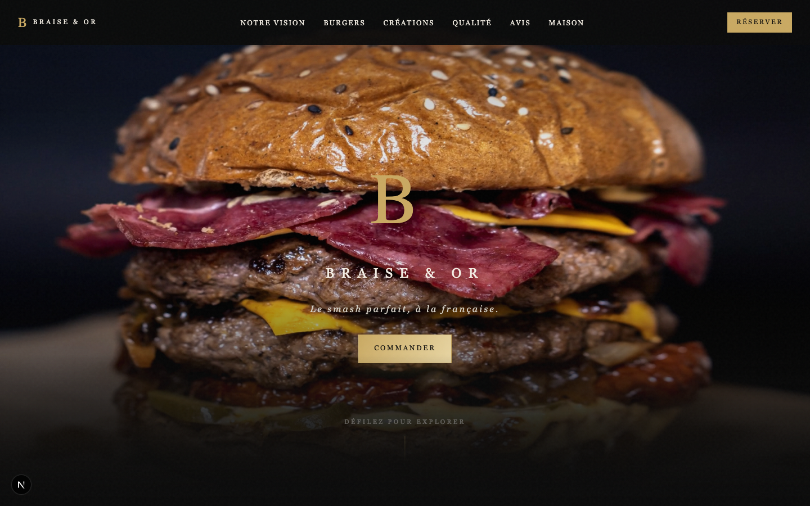

# restaurant

Site de demonstration pour presenter un concept de restaurant burger premium.

## Apercu



## Objectif

Ce projet a ete cree comme vitrine de presentation pour montrer une direction artistique, une mise en page immersive et une experience web orientee restauration.

## Contenu

- page d'accueil immersive
- univers de marque fictif
- mise en avant des produits, avis et reservation

## Stack

- Next.js
- React
- TypeScript

## Lancement en local

```bash
npm install
npm run dev
```

Le site est ensuite accessible sur le port configure dans le projet.

## Note

Il s'agit d'un site de demonstration concu pour presenter un savoir-faire en design et integration frontend.
